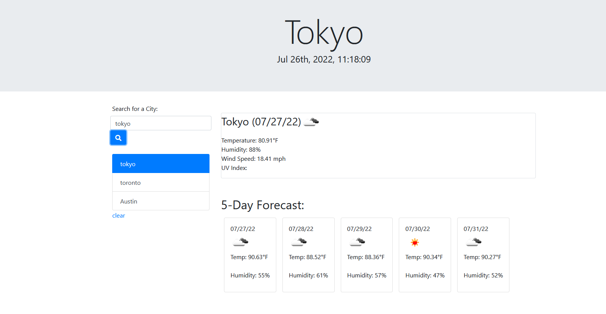

# Weather Dashboard

## Deployment

GitHub Pages DEPLOYED: https://tdickson96.github.io/Weather-Dashboard/

GitHub REPOSITORY: https://github.com/tdickson96/Weather-Dashboard/

## Description

This project allows users to search for a city and display the current and future weather conditions. As a user, I want my search history logged. The weather conditions display the city name, the date, an icon representation of weather conditions, the temperature, the humidity, the wind speed, and the UV index. When the user views the UV index, then they are shown a color that indiciates three stages: favorable, moderate, or severe. When the user views the future weather conditions for the specified city, then the user views a 5-day forecast that displays the date, an icon representation of the weather conditions, the temperature, the wind speed, and the humidity. When I click on the search history and choose a city, then I am again presented with current and future conditions for the searched city. 

## List of Features

<ol>
    <li>Search for a city</li>
    <li>Check current weather conditions(1-day forecast)</li>
    <li>Check future weather conditions (5-day forecast)</li>
    <li>Display city name</li>
    <li>Display date</li>
    <li>Display temperature</li>
    <li>Display humidity</li>
    <li>Display wind speed</li>
    <li>Display ultraviolet (UV) index</li>
    <li>Display three color stages for UV:
        <li>favorable (green)</li>
        <li>moderate (yellow)</li>
        <li>severe (red)</li>
    <li>Log search history and when a list item is clicked, then show the current and future weather conditions</li>
</ol> 

## Usage

## Author

Trent Dickson [GitHub](https://github.com/tdickson96)

## License

Copyright <2022> <Trent Dickson>

Permission is hereby granted, free of charge, to any person obtaining a copy of this software and associated documentation files (the "Software"), to deal in the Software without restriction, including without limitation the rights to use, copy, modify, merge, publish, distribute, sublicense, and/or sell copies of the Software, and to permit persons to whom the Software is furnished to do so, subject to the following conditions:

The above copyright notice and this permission notice shall be included in all copies or substantial portions of the Software.

THE SOFTWARE IS PROVIDED "AS IS", WITHOUT WARRANTY OF ANY KIND, EXPRESS OR IMPLIED, INCLUDING BUT NOT LIMITED TO THE WARRANTIES OF MERCHANTABILITY, FITNESS FOR A PARTICULAR PURPOSE AND NONINFRINGEMENT. IN NO EVENT SHALL THE AUTHORS OR COPYRIGHT HOLDERS BE LIABLE FOR ANY CLAIM, DAMAGES OR OTHER LIABILITY, WHETHER IN AN ACTION OF CONTRACT, TORT OR OTHERWISE, ARISING FROM, OUT OF OR IN CONNECTION WITH THE SOFTWARE OR THE USE OR OTHER DEALINGS IN THE SOFTWARE.